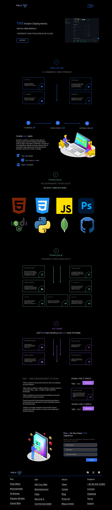

<h1>ma-go.net</h1>

MAGO je IT kompanija dizajnirana da predstavlja izuzetni kvalitet u razvoju softvera.

Mi radimo implementacije informacionih sistema, migracije postojećeg softvera i razvoj bilo kakvih rešenja za web platformu.

<a href="https://ma-go.net/" target="_blank">ma-go.net</a>

<h2>TMS - TIME MANAGEMENT SYSTEM</h2>

TMS je dizajniran da ponudi intuitivan alat za kompanije sa proizvodnjom

TMS rešava probleme vođenje radnika, radnog vremena i evidencija istog, plata, mnogih drugih aspekata kompanije

TMS je dizajniran da revolucionše korištenje poslovnih informacionih sistema na webu.

Pored pomenutih funkcionalnosti postoje sekundarne funkcionalnosti dizajnirane da učine korištenje sistema što jednostavnijim.

Sistem najbolje funkcioniše sa 125khz RFID čitačem uključujući i odgovarajuće unikatne tokene.

 

  
  
  

 
## License

[MIT](https://choosealicense.com/licenses/mit/)

 
 

##
[developed](https://github.com/goranivankovic)